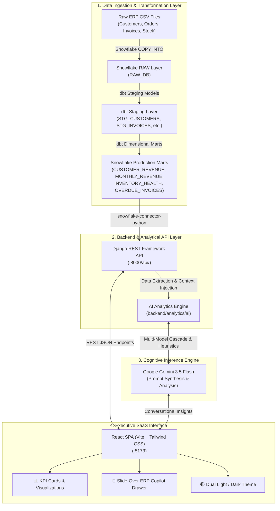
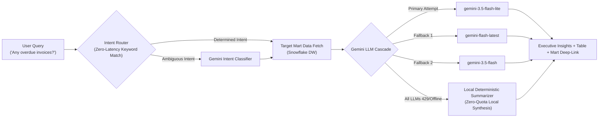

# 🚀 DataPilot AI — Enterprise ERP Intelligence & AI Copilot

[](https://www.python.org/)
[](https://www.snowflake.com/)
[](https://www.getdbt.com/)
[](https://www.djangoproject.com/)
[](https://react.dev/)
[](https://tailwindcss.com/)
[](https://aistudio.google.com/)

> **DataPilot AI** is an end-to-end, enterprise-grade business intelligence platform. It seamlessly links raw enterprise resource planning (ERP) transactions to a Snowflake cloud data warehouse, transforms them into dimensional business marts using dbt, serves them through a robust Django REST API, and presents insights via a modern SaaS dashboard equipped with a conversational Google Gemini AI Copilot.

---

## 📖 Table of Contents

1. [🌟 What is DataPilot AI?](#-what-is-datapilot-ai)
2. [🏗 System Architecture & Workflow](#-system-architecture--workflow)
3. [🤖 AI Copilot Dual-Layer Engine](#-ai-copilot-dual-layer-engine)
4. [✨ Key Features](#-key-features)
5. [📂 Project Folder Structure](#-project-folder-structure)
6. [⚡ Quickstart & Installation (Step-by-Step)](#-quickstart--installation-step-by-step)
7. [🔑 Environment Configuration](#-environment-configuration)
8. [🌐 REST API Reference](#-rest-api-reference)
9. [💬 Sample Copilot Questions](#-sample-copilot-questions)
10. [🛠 Troubleshooting & FAQ](#-troubleshooting--faq)
11. [👨‍💻 Author & Contact](#-author--contact)

---

## 🌟 What is DataPilot AI?

### The Problem
In most companies, executive decision-makers cannot access their own company's data without asking a business analyst or data engineer to write custom SQL. Reports take days or weeks, inventory stockouts go unnoticed, and overdue invoices slip through the cracks.

### The Solution
**DataPilot AI bridges the gap between raw data and executive decisions.**
Think of DataPilot as having a senior data engineer and a financial analyst sitting inside your browser 24/7:
- **No SQL Required**: Ask questions in plain English (*"Who are my top customers?"*, *"Which invoices are overdue?"*).
- **Direct Snowflake Warehouse Connectivity**: Queries run against verified, live analytics data marts—not simulated numbers.
- **Modern Executive Dashboard**: High-density SaaS design inspired by Linear and Stripe, featuring dual **Light & Dark mode**, interactive revenue charts, reorder alerts, and one-click CSV data exports.

---

## 🏗 System Architecture & Workflow

DataPilot AI follows industry best practices for the modern data & AI stack:



---

## 🤖 AI Copilot Dual-Layer Engine

To guarantee $100\%$ uptime even during free-tier API rate limits or network disruptions, the Copilot features a multi-tiered fallback architecture:



1. **Zero-Quota Intent Dispatch**: Classifies common business phrases in $\approx 0.001\text{s}$ without consuming daily LLM token quotas.
2. **Multi-Model LLM Cascade**: If one Gemini model tier experiences rate limits (`429`) or server load (`503`), the engine automatically falls back to secondary model tiers.
3. **Deterministic Heuristic Failsafe**: If all external AI APIs are unreachable, a local analytical summarizer generates clear business insights from the live Snowflake records.

---

## ✨ Key Features

| Feature | Description |
| :--- | :--- |
| **Executive KPI Strip** | Real-time metric cards displaying total account revenue, active customer count, stock health, and total delinquent debt. |
| **Interactive Revenue Chart** | Area chart tracking historical monthly revenue with 6M/12M/All range selectors, high/low period summaries, and custom tooltips. |
| **Supply Chain Health** | Identifies critical stockouts and items below minimum reorder thresholds with instant status pills. |
| **Overdue Invoices Aging** | Tracks delinquent receivables, calculates days overdue, and highlights high-risk aged debts. |
| **Conversational Copilot** | Natural language chat drawer accessible from anywhere on the dashboard with quick suggestion chips. |
| **Snowflake Data Inspector** | Toggle between structured tabular views and formatted raw JSON payloads for all warehouse records. |
| **Dual Light / Dark Mode** | Clean, minimalist enterprise aesthetic with automatic theme persistence via `localStorage`. |
| **One-Click CSV Export** | Export filtered customer lists, inventory audits, or overdue debt records directly to CSV. |

---

## 📂 Project Folder Structure

```text
datapilot-AI/
├── backend/                         # Django REST Framework Backend
│   ├── analytics/                   # Analytics Application
│   │   ├── ai/                      # AI Copilot & LLM Engine
│   │   │   ├── copilot.py           # Copilot request router & context builder
│   │   │   └── gemini_service.py    # Resilient Gemini cascade & local summarizer
│   │   ├── services/                # Snowflake database connector & query helpers
│   │   │   └── snowflake_client.py
│   │   ├── urls.py                  # API endpoints routing
│   │   └── views.py                 # REST controller views
│   ├── config/                      # Django project settings & WSGI/ASGI
│   │   ├── settings.py
│   │   └── urls.py
│   └── manage.py                    # Django management CLI
│
├── dbt/                             # dbt (data build tool) Project
│   └── erp_copilot/
│       ├── models/
│       │   ├── staging/             # Cleaned views (stg_customers, stg_orders, etc.)
│       │   └── marts/               # Final business marts (customer_revenue, etc.)
│       └── dbt_project.yml
│
├── frontend/                        # React Frontend (Vite + Tailwind CSS)
│   ├── src/
│   │   ├── components/              # Reusable UI components
│   │   │   ├── Header.jsx           # Top navbar with theme toggle & connection radar
│   │   │   ├── KpiCard.jsx          # Metric cards with trend indicators
│   │   │   ├── RevenueChart.jsx     # Recharts analytical area chart
│   │   │   ├── TopCustomersTable.jsx
│   │   │   ├── InventoryTable.jsx
│   │   │   ├── OverdueInvoicesTable.jsx
│   │   │   ├── MonthlyBreakdownTable.jsx
│   │   │   └── CopilotChat.jsx      # AI Copilot chat drawer & data inspector
│   │   ├── layout/                  # Navigation & sidebar
│   │   │   └── Sidebar.jsx
│   │   ├── pages/                   # Main view controller
│   │   │   └── DashboardPage.jsx
│   │   ├── services/api.js          # Axios API client
│   │   └── index.css                # Tailwind v4 styles & theme tokens
│   ├── package.json
│   └── vite.config.js
│
├── snowflake/                       # Snowflake DDL & DML SQL scripts
│   ├── 001_setup.sql                # Warehouse & Database creation
│   ├── 002_raw_tables.sql           # Raw table schemas
│   ├── 003_staging_views.sql        # Staging view queries
│   └── 004_marts.sql                # Analytical mart definitions
│
├── data/                            # Raw sample CSV data (ERP exports)
│   ├── customers.csv
│   ├── products.csv
│   ├── orders.csv
│   ├── order_items.csv
│   ├── invoices.csv
│   └── inventory.csv
│
├── .env.example                     # Environment variables template
├── requirements.txt                 # Backend Python dependencies
└── README.md                        # Documentation
```

---

## ⚡ Quickstart & Installation (Step-by-Step)

Follow these steps to run the entire stack locally on your machine.

### Prerequisites

Make sure you have installed:
- **Python 3.10+** ([Download](https://www.python.org/downloads/))
- **Node.js 18+ & npm** ([Download](https://nodejs.org/))
- **Git** ([Download](https://git-scm.com/))
- A **Snowflake Account** ([Free 30-day Trial](https://signup.snowflake.com/))
- A **Google Gemini API Key** ([Free API Key from Google AI Studio](https://aistudio.google.com/app/apikey))

---

### Step 1: Clone the Repository

```bash
git clone https://github.com/SagarBawanthade/DataPilot-AI-Data-Engineering-Analytics-Engineering-AI-Engineering-.git
cd DataPilot-AI-Data-Engineering-Analytics-Engineering-AI-Engineering-
```

---

### Step 2: Set Up Python Virtual Environment & Install Dependencies

```bash
# 1. Create a Python virtual environment
python3 -m venv .venv

# 2. Activate the virtual environment
# On Linux / macOS:
source .venv/bin/activate
# On Windows:
# .venv\Scripts\activate

# 3. Install required Python packages
pip install --upgrade pip
pip install -r requirements.txt
```

---

### Step 3: Configure Environment Variables

Copy the `.env.example` file to create your local `.env`:

```bash
cp .env.example .env
```

Open `.env` in any text editor and fill in your credentials:

```env
# Snowflake Data Warehouse Credentials
SNOWFLAKE_ACCOUNT=xy12345.ap-south-1.aws
SNOWFLAKE_USER=YOUR_USERNAME
SNOWFLAKE_PASSWORD=YOUR_PASSWORD
SNOWFLAKE_WAREHOUSE=COMPUTE_WH
SNOWFLAKE_DATABASE=ERP_DB
SNOWFLAKE_SCHEMA=MARTS
SNOWFLAKE_ROLE=ACCOUNTADMIN

# Google Gemini API Key (Required for AI Copilot)
GEMINI_API_KEY=AIzaSyYourSecretGeminiApiKeyHere
```

> [!TIP]
> If you already have your Snowflake warehouse and database created, ensure your user has `SELECT` permissions on the `MARTS` schema.

---

### Step 4: Run the Backend Analytics Server

From the project root:

```bash
python backend/manage.py runserver
```

The Django REST API will be active at:
👉 **`http://127.0.0.1:8000`**

To verify, open your browser or run:
```bash
curl http://127.0.0.1:8000/api/customers/top/
```

---

### Step 5: Start the React Frontend

Open a **new terminal tab**, navigate into the `frontend` folder, install npm packages, and launch Vite:

```bash
cd frontend
npm install
npm run dev
```

The React dashboard will be live at:
👉 **`http://localhost:5173`**

Open `http://localhost:5173` in your browser to interact with the dashboard and ask questions to the Copilot! 🎉

---

## 🔑 Environment Configuration

| Variable | Required | Description | Example |
| :--- | :---: | :--- | :--- |
| `SNOWFLAKE_ACCOUNT` | **Yes** | Your Snowflake account locator with region | `xy12345.ap-south-1.aws` |
| `SNOWFLAKE_USER` | **Yes** | Snowflake username | `SAGAR_ADMIN` |
| `SNOWFLAKE_PASSWORD` | **Yes** | Snowflake user password | `YourPassword123!` |
| `SNOWFLAKE_WAREHOUSE` | **Yes** | Active compute warehouse | `COMPUTE_WH` |
| `SNOWFLAKE_DATABASE` | **Yes** | Analytics database | `ERP_DB` |
| `SNOWFLAKE_SCHEMA` | **Yes** | Schema containing mart tables | `MARTS` |
| `SNOWFLAKE_ROLE` | No | Role with warehouse access (default: `ACCOUNTADMIN`) | `ACCOUNTADMIN` |
| `GEMINI_API_KEY` | **Yes** | Google Gemini API Key from AI Studio | `AIzaSy...` |

---

## 🌐 REST API Reference

All backend endpoints return JSON payloads consumed by the React dashboard:

| Method | Endpoint | Description | Sample Query / Response |
| :---: | :--- | :--- | :--- |
| `GET` | `/api/customers/top/` | Returns the top 10 enterprise accounts ranked by revenue | `[{"CUSTOMER_NAME": "Welch-Hill", "TOTAL_REVENUE": 1343099.31, ...}]` |
| `GET` | `/api/revenue/monthly/` | Returns monthly aggregated revenue and order volumes | `[{"REVENUE_MONTH": "2026-08-01", "REVENUE": 1250000, ...}]` |
| `GET` | `/api/inventory/health/` | Returns stock status for all monitored SKUs | `[{"PRODUCT_NAME": "Laptop", "STOCK_STATUS": "LOW", ...}]` |
| `GET` | `/api/invoices/overdue/` | Returns all unpaid invoices past their due date | `[{"INVOICE_ID": 101, "DAYS_OVERDUE": 34, ...}]` |
| `POST` | `/api/copilot/` | Submits a natural language prompt to the AI Copilot | Body: `{"question": "Who are my top customers?"}` |

---

## 💬 Sample Copilot Questions

You can click any suggestion chip or type your own business inquiries:

```text
Q: "Who are my top customers?"
A: "Here are your top-performing customers ranked by total revenue:
    1. Welch-Hill: $1,343,099.31 across 12 orders
    2. Lee-Villarreal: $1,150,592.12 across 10 orders..."

Q: "Show monthly revenue trend"
A: "Over the 25-month historical period, revenue exhibits a cyclical pattern 
    peaking in August 2026 at ₹1.35M..."

Q: "Any overdue invoices?"
A: "You currently have 10 overdue accounts receivables totaling ₹342,000. 
    The highest aging balance belongs to Customer #24..."

Q: "How is inventory health?"
A: "Out of 50 monitored products, 4 SKUs have fallen below the critical 
    safety threshold and require immediate purchase orders..."
```

---

## 🛠 Troubleshooting & FAQ

### 1. `CORS Error` in the browser console
- Ensure the backend has `django-cors-headers` enabled and `CORS_ALLOWED_ORIGINS = ["http://localhost:5173"]` in `backend/config/settings.py`.

### 2. `Unable to reach the ERP Copilot service`
- Make sure the Django backend is running in your first terminal window on port 8000 (`python backend/manage.py runserver`).
- Check that the frontend API client is pointing to `http://127.0.0.1:8000/api`.

### 3. `Gemini API 429: Resource Exceeded Quota`
- DataPilot AI includes an automatic fallback cascade and local heuristic summarizer. If you exceed the free-tier quota, the engine switches automatically to secondary models or generates an immediate deterministic data summary.

### 4. `Snowflake OperationalError: 250001 Failed to connect`
- Double-check your `SNOWFLAKE_ACCOUNT` identifier in `.env`. Do not include `https://` in the account name (use `xy12345.ap-south-1.aws`, not `https://xy12345.snowflakecomputing.com`).

---

## 👨‍💻 Author & Contact

**Sagar Uttam Bawanthade**  
*Data Engineer & AI Systems Developer*  
MCA — MIT World Peace University

- **GitHub**: [@SagarBawanthade](https://github.com/SagarBawanthade)
- **Domain Specializations**: Data Engineering (Snowflake, dbt, Airflow) • Analytics Engineering • AI Engineering & LLM Orchestration • Python & Django • React & Modern Web Applications

---

### ⭐ Show your support
If you find this project helpful or inspiring, please give it a **Star** on GitHub! ⭐